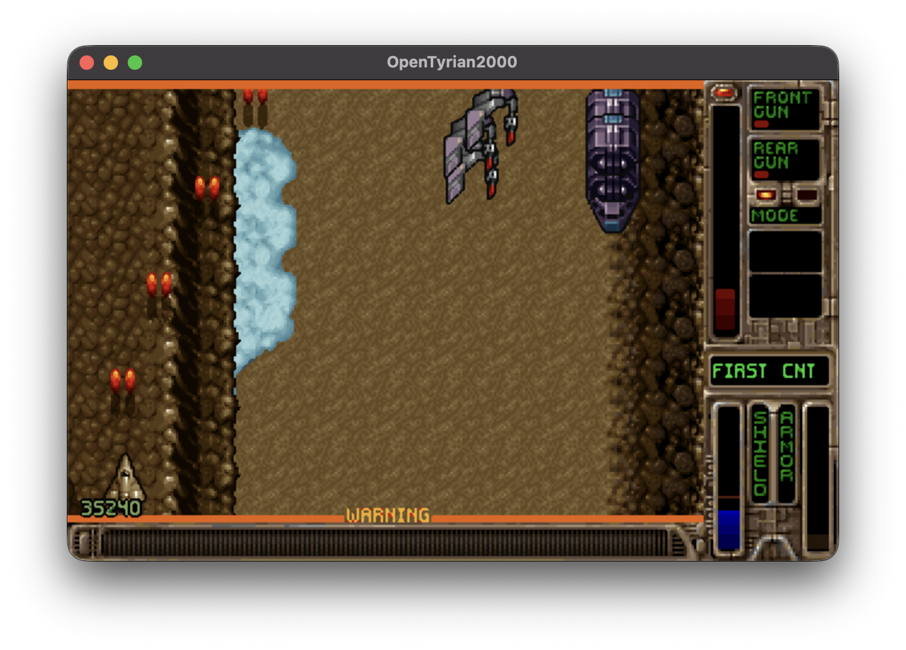
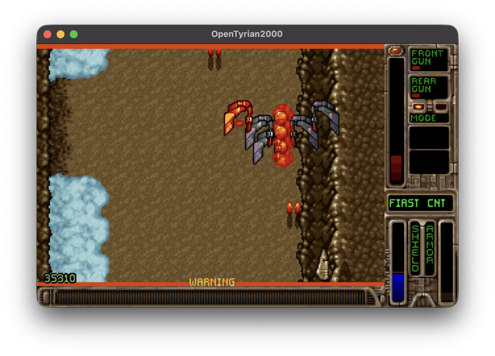
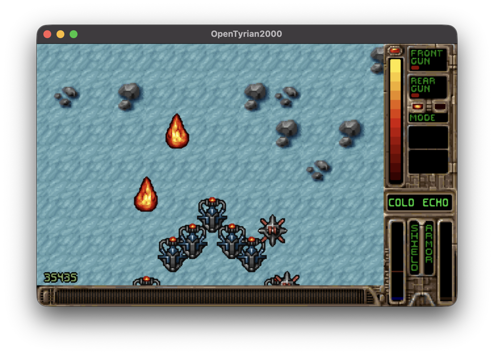
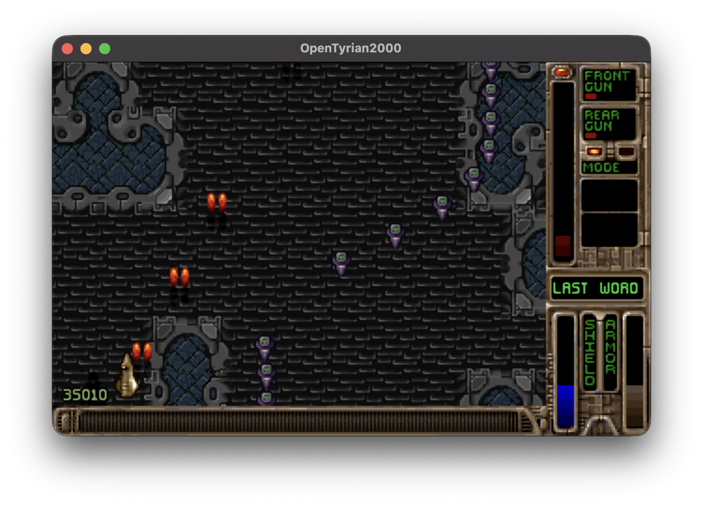
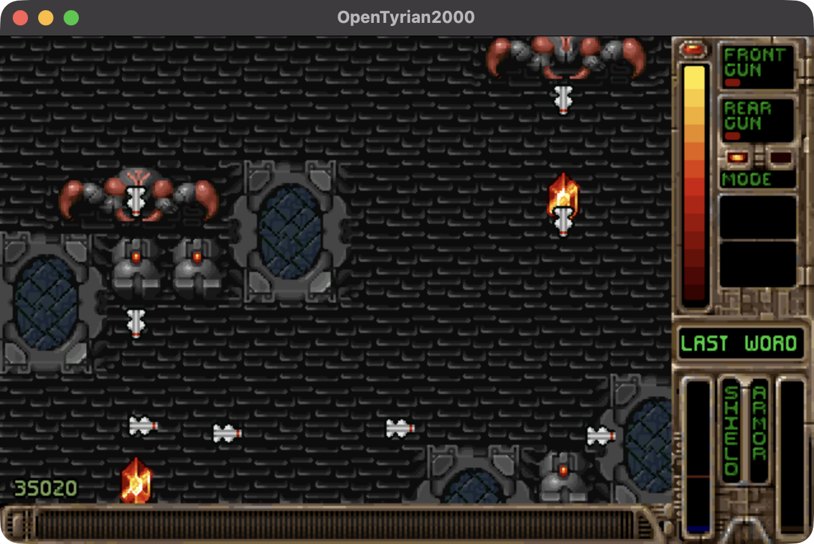

OpenTyrian2000 — Episode 6: First Contact
================================================================================

This repository is a fork of OpenTyrian2000 centered on Episode 6: First
Contact, a complete new Tyrian campaign with eight original missions. It
continues beyond the original episodes with a new story, new mission routes,
progressive equipment shops, varied combat encounters, and environments
assembled from the artwork and visual styles of all five original episodes.

The goal is to make Episode 6 feel like a natural extension of Tyrian 2000:
familiar in its art, music, enemies, and weapons, but distinct in its campaign
structure, locations, and atmosphere.

OpenTyrian2000 is itself an open-source port of the DOS game Tyrian and a fork
of OpenTyrian. Tyrian is an arcade-style vertical scrolling shooter set in the
year 20,031, starring fighter pilot Trent Hawkins.

== The New Episode ==============================================================

Episode 6 begins when an unknown transmission reaches Trent from beyond the
charted galaxy. Following the signal reveals a chain of abandoned systems,
living machines, corrupted worlds, and a hidden intelligence waiting at the
source.

The journey moves through frozen vaults, volcanic ruins, an infected jungle
moon, an artificial black sun, a fractured machine paradise, and the buried
cathedral of the First Voice. Each mission has its own scenery and encounter
style instead of repeating a single visual theme.

## Actual gameplay

These screenshots were captured directly from a running Episode 6 game. They
include the player ship, enemies, weapons, explosions, HUD, and mission names.

### FIRST CNT





### COLD ECHO



### LAST WORD





The eight missions are:

1. FIRST CNT  -- the first encounter with the unknown transmission
2. COLD ECHO  -- a remixed ice vault and the Cryo Warden
3. FROSTGATE  -- crystal gates, buried installations, and a derelict fleet
4. CINDERWAY  -- volcanic canyons, fossils, and living machinery
5. NIGHTROOT  -- an infected jungle moon and the Rootmind
6. BLACK SUN  -- orbital wreckage, an asteroid foundry, and the Null Core
7. PALE EDEN  -- a fractured machine paradise guarded by SERAPH-0
8. LAST WORD  -- the broadcast cathedral and the First Voice

Episode 6 includes an original connected story, mission briefings, progressive
equipment shops, equipment from the original episodes, and a full ending. It
remains faithful to the look and feel of Tyrian 2000 while taking the campaign
into places the original game never visited.

== Install the Episode ==========================================================

OpenTyrian2000 requires the Tyrian 2000 data files, which have been released
as freeware:

  https://www.camanis.net/tyrian/tyrian2000.zip

First download the original data and extract Episodes 1–5 into the repository's
`data/` folder. Episode 6 is built from those original game assets, so they must
be present before running the Episode 6 tool.

From the repository root, enter the Episode 6 tools folder and build the new
episode:

```sh
cd tools/episode6
python3 generate_episode6.py
```

The tool validates the episode and automatically adds these three generated
files to the repository's `data/` folder:

- `tyrian6.lvl`
- `levels6.dat`
- `cubetxt6.dat`

Return to the repository root and start Episode 6:

```sh
cd ../..
./opentyrian2000 --data=data --episode=6
```

== Keyboard Controls ===========================================================

alt-enter      -- toggle full-screen

arrow keys     -- ship movement
space          -- fire weapons
enter          -- toggle rear weapon mode
ctrl/alt       -- fire left/right sidekick

== Network Multiplayer =========================================================

Currently OpenTyrian2000 does not have an arena; as such, networked games must
be initiated manually via the command line simultaneously by both players.

syntax:
  opentyrian2000 --net HOSTNAME --net-player-name NAME --net-player-number NUM

where HOSTNAME is the IP address of your opponent, NUM is either 1 or 2
depending on which ship you intend to pilot, and NAME is your alias

OpenTyrian2000 uses UDP port 1333 for multiplayer, but in most cases players
will not need to open any ports because OpenTyrian2000 makes use of UDP hole
punching.

Note that Network play has not been tested for OpenTyrian2000.

== Links =======================================================================

* For OpenTyrian2000
project: https://github.com/KScl/opentyrian2000

* For OpenTyrian
project: https://github.com/opentyrian/opentyrian
irc:     ircs://irc.oftc.net/#opentyrian
forums:  https://tyrian2k.proboards.com/board/5
